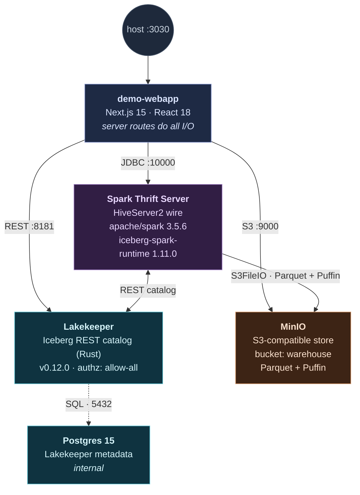

# Open Lakehouse with Iceberg V3 — Lakekeeper, Spark, MinIO on Docker

Tech demo of an open lakehouse on Apache Iceberg **format-version 3**. One
`terraform apply` brings up six containers on a single Docker network. SQL is
driven through the Spark Thrift Server (HiveServer2 wire protocol on `:10000`),
so `beeline` or any JDBC client works. A Next.js webapp on `:3030` drives the
same SQL from the browser and shows live state in MinIO, Lakekeeper, and the
Iceberg snapshot log per step.

## Architecture



Six containers on the `lakedemo` Docker network. Postgres holds Lakekeeper's
metadata; MinIO holds Iceberg's data and metadata files; Lakekeeper hands
out S3 paths and table snapshots; Spark Thrift executes the SQL; the webapp
is a thin server that talks to all three at once.

## Run

### One-shot (recommended)

```bash
./deploy.sh
```

`deploy.sh` ensures the Docker daemon is running (launches Docker Desktop on
macOS, `systemctl start docker` on Linux), runs `terraform init` /
`terraform apply`, and waits for the Spark Thrift Server to accept JDBC. The
stack comes up **empty** so you can run each step yourself from the webapp.
Set `RUN_DEMO=1` to batch the whole `sql/demo.sql` through beeline instead.

```bash
./deploy.sh                          # bring up an empty stack (run steps in the webapp)
RUN_DEMO=1 ./deploy.sh               # bring up + run all of demo.sql end-to-end
./destroy.sh                         # tear down (destroy + force-remove any stragglers)
```

### Manual

```bash
terraform init
terraform apply -auto-approve        # stands up the stack + bootstraps the warehouse
terraform output run_demo            # prints the beeline command
docker exec spark-thrift /opt/spark/bin/beeline -u jdbc:hive2://localhost:10000 -f /opt/demo/demo.sql
```

Docker daemon must already be running for the manual path. First Spark start
downloads the Iceberg jars from Maven (needs internet); give it a minute or two
before the Thrift Server accepts connections.

Endpoints: **Webapp `:3030`**, Lakekeeper UI `:8181/ui/`, MinIO console `:9001`, Thrift JDBC `:10000`.

## Webapp

`http://localhost:3030` runs the demo from the browser. Each section of
`sql/demo.sql` is one page: SQL with a Run button on the left, a short
explanation in the middle, and live state on the right. The right pane
shows the MinIO file tree (added/changed/removed files colored per
section), the Lakekeeper catalog, and the Iceberg snapshot timeline.
Long INSERTs stream progress over SSE so the browser does not time out.
State is in-memory; the cache resets when `demo-webapp` restarts.

### Prereqs

- `docker` (Docker Desktop on macOS, or Docker Engine on Linux)
- `terraform` >= 1.5
- `curl` (for the bootstrap step)

## Layout

```
main.tf, variables.tf, outputs.tf   # Terraform root
deploy.sh                           # one-shot launcher (Docker → terraform → beeline)
destroy.sh                          # teardown (terraform destroy + force-remove stragglers)
scripts/bootstrap.sh                # MinIO bucket + Lakekeeper warehouse registration
sql/demo.sql                        # V3 showcase (mounted into spark-thrift at /opt/demo)
spark/spark-defaults.conf           # Iceberg packages + REST catalog wiring
```

## What the demo shows (18 sections)

Each section is a page in the webapp and a block in `sql/demo.sql`.

1. **Create V3 trades table.** `format-version=3` + MoR writer modes. Hidden partitioning `days(ts), bucket(8, symbol)`.
2. **Bulk INSERT.** Row count and synthetic-history span are picked from a Demo size panel above the SQL editor (1M / 30 days by default, presets up to 50M). Streamed over SSE so the browser does not time out.
3. **DELETE: deletion vector.** MoR `DELETE` writes a Puffin DV (`file_format='puffin'`, `content=1`). Parquet untouched.
4. **UPDATE: DV + Parquet.** UPDATE = DELETE old + INSERT new. NVDA spans every active day partition, so one Puffin DV per partition plus one small replacement Parquet.
5. **Row lineage.** `_row_id` + `_last_updated_sequence_number` for CDC without a separate pipeline. The `.changes` metadata view is documented (its projection shape and CDC role); the live query is skipped because Spark 3.5 + Iceberg 1.11 changelog scans cannot yet read through Puffin deletion vectors.
6. **ADD COLUMN.** Schema evolution by field ID. Zero data files touched; old rows read back as NULL for the new column.
7. **V2 contrast.** Same `DELETE` on a V2 sibling writes positional Parquet deletes side-by-side with the V3 Puffin.
8. **Compaction + expiry.** `rewrite_data_files`, `rewrite_manifests`, `expire_snapshots`. Folds DVs back into clean Parquet.
9. **`MERGE INTO`.** CDC upsert primitive. Matched rows get a DV; unmatched rows append as fresh Parquet.
10. **CoW vs MoR.** Build a `copy-on-write` sibling, run the same DELETE on both, compare bytes-written and file count.
11. **Partition evolution.** `REPLACE PARTITION FIELD ts_day WITH hours(ts)`. New writes go under `ts_hour=`; old data stays in `ts_day=`.
12. **Schema evolution.** `RENAME COLUMN`, `DROP COLUMN`, type widen. All metadata-only because Iceberg tracks fields by ID.
13. **Branches and tags + `.refs`.** Write-audit-publish via `branch_staging` + `CREATE TAG release-v1`. The `.refs` metadata view lists every branch and tag in one row.
14. **Rollback + time travel + `.history`.** Tag a known-good snapshot, do a bad delete, `set_current_snapshot` to recover. The `.history` view walks the `parent_id` chain.
15. **Sort orders + clustering.** Iceberg's three clustering levers: hidden partitioning (step 1), `WRITE ORDERED BY` table-level sort order (this step), and Z-order rewrite (step 17). After the sorted INSERT the latest snapshot's files show tight, non-overlapping `readable_metrics.symbol.{lower_bound,upper_bound}` vs the interleaved bounds on older files.
16. **Perf + price payoff.** Build a flat sibling (no partition, no sort) and put it side-by-side with the partitioned + sorted table on the same predicate. Manifest-level pruning counts how many files a `WHERE symbol = 'NVDA'` query would touch — derived from per-file bounds, no scan needed.
17. **Maintenance jobs.** `rewrite_data_files` (bin-pack + Z-order syntax shown), `compute_table_stats` materializing Puffin theta sketches into `metadata.json.statistics[]` (the lineage graph picks up a fresh `stats-puffin` node), `rewrite_manifests`, `expire_snapshots`. The `.partitions` view summarizes record counts per partition tuple.
18. **Wrap-up.** Live counters (snapshots, Puffin DVs vs positional deletes, MinIO objects), a V3 coverage matrix (what's wired vs deliberately skipped) and the production-hardening checklist.

The webapp at `:3030` mirrors each section as a clickable page and adds an
**Iceberg lineage graph** (per-step and global at `/graph`). The graph is a clickable
`catalog → metadata.json → manifest-list → manifest → data + delete` walk
with dashed edges for the deletion vectors that shadow each data file.

A **theme toggle** in the header flips the UI between dark (default) and
light. Choice persists in `localStorage`; first paint uses `prefers-color-scheme`.

## Production hardening

Taking this stack to production means closing the gaps the demo leaves open:
authn/authz on Lakekeeper (OIDC + OpenFGA in place of `allow-all`), credential
vending (`rest.access-delegation=vended-credentials`) instead of static MinIO
keys, HA Postgres for the catalog backend, S3/GCS/Azure Blob in place of MinIO,
maintenance jobs (compaction, orphan reap, snapshot expiry) wired into an
Airflow/Argo/Kestra/Spark schedule, Prometheus scraping on Lakekeeper + Spark +
MinIO, and CI gating on every `sql/` change. The webapp&apos;s wrap-up page
(`/step/18`) walks the same checklist with live links.

## How V3 compares

| Feature                            | Iceberg V1          | Iceberg V2                       | **Iceberg V3**                   | Delta Lake                       |
| ---------------------------------- | ------------------- | -------------------------------- | -------------------------------- | -------------------------------- |
| Row-level `DELETE` / `UPDATE`      | rewrite data files  | positional deletes (Parquet)     | **deletion vectors (Puffin)**    | deletion vectors (Roaring 64)    |
| Row lineage (`_row_id`, seq #)     | —                   | —                                | **yes**                          | —                                |
| Default column values              | —                   | —                                | **yes**                          | yes (3.x)                        |
| `VARIANT` semi-structured type     | —                   | —                                | **yes (spec)**                   | yes                              |
| Nanosecond timestamps              | —                   | —                                | **yes (spec)**                   | µs only                          |
| Hidden partitioning                | yes                 | yes                              | yes                              | generated columns                |
| Schema add / drop / rename / reorder | yes               | yes                              | yes                              | add / drop / rename              |
| Time travel                        | yes                 | yes                              | yes                              | yes                              |
| Open REST catalog spec             | —                   | yes                              | yes                              | Unity OSS / Hive                 |
| Engine breadth                     | broad               | broad                            | broad                            | Spark-first, growing             |

Sources for the comparison are linked in the [footer](#sources).

## Caveats worth knowing

- **Spark 3.5 + Iceberg 1.11** covers deletion vectors, row lineage, default
  values, and maintenance. The newer V3 *types* — `VARIANT` and nanosecond
  timestamps — need a **Spark 4.0** build and are intentionally left out of the
  core script. Bump `apache/spark` and the `iceberg-spark-runtime-4.0` package to
  add them.
- Lakekeeper runs **unsecured** (`allow-all`, no IdP) — demo only. For anything
  real, wire an OIDC provider and OpenFGA.
- Spark uses **static MinIO creds** for determinism. Switch to Lakekeeper
  **credential vending** in production (drop the `s3.*` keys, set
  `rest.access-delegation` to `vended-credentials`).
- Pin versions: `lakekeeper_version` (default `v0.12.0`) and the Spark/Iceberg
  versions in `spark/spark-defaults.conf`. The Lakekeeper warehouse JSON shape is
  version-sensitive — if `apply` fails at bootstrap, check the Storage guide for
  your Lakekeeper version.
- Bootstrap (bucket + warehouse) is an imperative `local-exec` step, not pure
  HCL — that's the normal split: Terraform for infra, a provisioner for catalog
  init. Needs `docker` + `curl` on the host.

## Troubleshooting

These mostly bite on a fresh Linux VM, not on Docker Desktop. `deploy.sh`
handles them for you; the manual `terraform` path doesn't, so here's what
breaks and how to fix it by hand.

### Docker daemon won't start (`Unit docker.service not found`)

The daemon ships under a different unit name on some installs, so a plain
`sudo systemctl start docker` misses it. `deploy.sh` probes `docker.service`,
`snap.docker.dockerd.service`, the `docker-desktop` user unit, then falls back
to `snap start docker` and SysV `service docker start`. If none exist, Docker
Engine probably isn't installed: `curl -fsSL https://get.docker.com | sudo sh`.

### `network lakedemo not found` during bootstrap

`terraform apply` stands the containers up, but `bootstrap.sh` fails on the
MinIO step with `network lakedemo not found`. Cause: the Docker provider
(`provider "docker" {}`) honors `DOCKER_HOST` but ignores `docker context`,
while the CLI honors both. With `DOCKER_HOST` unset and a non-default active
context (rootless Docker, Docker Desktop for Linux), Terraform builds the
network on one daemon and `bootstrap.sh`'s `docker run` looks on another.

Fix: point both at the same daemon before applying.

```bash
export DOCKER_HOST=$(docker context inspect -f '{{ .Endpoints.docker.Host }}')
# or just: docker context use default
```

`deploy.sh` does this for you (`align_docker_host`), and `bootstrap.sh` reads the
network straight off the `lake-minio` container instead of trusting the
passed-in name.

### `network with name lakedemo already exists`

`apply` fails creating `docker_network.lake` because the network exists on the
daemon but isn't in Terraform state — usually after a daemon/context switch or
a wiped state file. Adopt it instead of recreating:

```bash
terraform import docker_network.lake "$(docker network inspect lakedemo -f '{{.Id}}')"
terraform apply -auto-approve
```

Or wipe it (clean slate, demo only):

```bash
docker rm -f lake-postgres lake-minio lakekeeper lake-migrate spark-thrift demo-webapp 2>/dev/null || true
docker network rm lakedemo
```

`deploy.sh` reconciles this automatically before `apply` (imports the orphan, or
removes it if the import fails). The same class of error can hit container names
(`container name already in use`) — clear them with the `docker rm -f` line above.

### Webapp build hangs ~15 min, then `npm install` fails with `bad address`

`docker build` runs each `RUN` step inside a container, so the build needs DNS
**inside containers**, not just on the host. The usual culprit on a fresh VM:
`/etc/resolv.conf` points at the systemd-resolved stub `127.0.0.53` (which
containers can't reach) and Docker's `8.8.8.8` fallback is blocked. Host `curl`
works; the container can't resolve anything.

Confirm it:

```bash
docker run --rm busybox nslookup registry.npmjs.org   # "bad address" = broken
```

Fix: give the daemon a real upstream resolver in `/etc/docker/daemon.json`, then
restart it:

```json
{ "dns": ["<your-host-upstream-ip>", "1.1.1.1"] }
```

```bash
sudo systemctl restart docker
```

Find your upstream with `resolvectl status` or `nmcli dev show | grep DNS`.
`deploy.sh` (`ensure_container_internet`) probes container DNS and writes this
config for you on Linux. Skip the whole check with `SKIP_NET_CHECK=1 ./deploy.sh`
when you're offline and building against pre-pulled images. On macOS / Docker
Desktop, set the `dns` key under Settings → Docker Engine instead.

### Bootstrap dies with a Python `JSONDecodeError`

Right after the warehouse is registered, Lakekeeper's `/catalog/v1/config`
endpoint can briefly return an empty or non-JSON body. The prefix lookup in
`bootstrap.sh` polls until it gets a parseable response and prints the last body
if it gives up. If you hit that failure message, the warehouse probably didn't
register at all (check `docker logs lakekeeper`).

---

## Sources

Used to validate the comparison table above:

- Apache Iceberg table spec (V1 / V2 / V3) — <https://iceberg.apache.org/spec/>
- `apache/iceberg · format/spec.md` — <https://github.com/apache/iceberg/blob/main/format/spec.md>
- Delta Lake protocol (current) — <https://github.com/delta-io/delta/blob/master/PROTOCOL.md>
- Apache Iceberg releases (1.9 → 1.11) — <https://github.com/apache/iceberg/releases>
