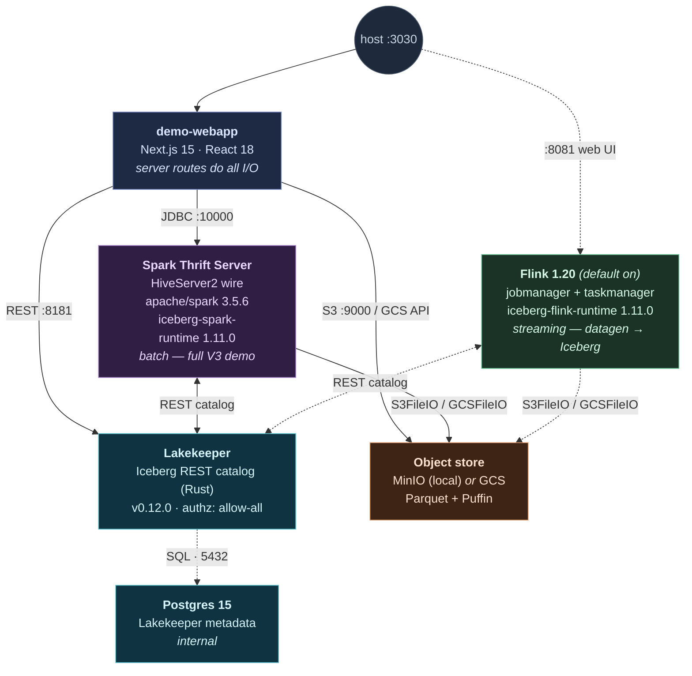

# Open Lakehouse with Iceberg v3: Lakekeeper, Spark, Flink and MinIO on Docker

[](https://github.com/Vadoid/open-lakehouse-demo/actions/workflows/ci.yml)
[](LICENSE)

Tech demo of an open lakehouse on Apache Iceberg **format version 3**. One
`terraform apply` brings up eight containers on a single Docker network (six without
the optional Flink streaming engine). SQL is
driven through the Spark Thrift Server (HiveServer2 wire protocol on `:10000`),
so `beeline` or any JDBC client works. A Next.js webapp on `:3030` drives the
same SQL from the browser and shows live state in the object store, Lakekeeper,
and the Iceberg snapshot log per step. A second engine, **Apache Flink 1.20**,
runs by default: it streams a continuous `datagen → Iceberg` job into the *same*
Lakekeeper catalog and object store while Spark queries it, so the demo shows
multi-engine interop on one source of truth.

Storage is swappable. By default everything lands in MinIO, but the webapp's
first-run setup screen can point the warehouse at Google Cloud Storage instead.
The UI relabels itself for whichever target is active. The diagram, file tree,
lineage graph, and wrap-up all follow. See
[Storage targets](#storage-targets-minio-or-gcs).

For a themed view of what's landed lately — the Flink engine, swappable storage,
the Apache-2.0 relicense, the webapp overhaul — see [CHANGELOG.md](CHANGELOG.md).

## Architecture



Six containers on the `lakedemo` Docker network (Postgres, MinIO, Lakekeeper,
Spark Thrift, the webapp, plus the one-shot Lakekeeper migrate job). Postgres
holds Lakekeeper's metadata; MinIO holds Iceberg's data and metadata files;
Lakekeeper hands out object-store paths and table snapshots; Spark Thrift
executes the SQL; the webapp is a thin server that talks to all three at once.

Two more containers — **Flink jobmanager + taskmanager** (dashed above) — run by
default alongside the others; opt out at the deploy menu or with `ENABLE_FLINK=0`. They read and write
the *same* Lakekeeper catalog and MinIO bucket as Spark. See
[Flink streaming engine (on by default)](#flink-streaming-engine-on-by-default).

In GCS mode a Google Cloud Storage bucket takes MinIO's place. Spark writes
`gs://` paths through `GCSFileIO` (Iceberg's `ResolvingFileIO` picks the right
FileIO from the URI scheme), and the webapp reads the bucket with the
service-account key. Spark itself never gets that key: Lakekeeper vends it a
short-lived per-table OAuth token via the `X-Iceberg-Access-Delegation` header.

## Run

### One-shot (recommended)

```bash
./deploy.sh
```

`deploy.sh` ensures the Docker daemon is running (launches Docker Desktop on
macOS, `systemctl start docker` on Linux), runs `terraform init` /
`terraform apply`, and waits for the Spark Thrift Server to accept JDBC. The
stack comes up **empty** so you can run each step yourself from the webapp.
Set `RUN_DEMO=1` to batch the whole `sql/demo.sql` through beeline instead.

```bash
./deploy.sh                          # bring up an empty stack (run steps in the webapp)
RUN_DEMO=1 ./deploy.sh               # bring up + run all of demo.sql end-to-end
./destroy.sh                         # tear down (local only, leaves any GCS bucket/SA)
CLEANUP_GCS=1 ./destroy.sh           # also delete the auto-created GCS bucket + service account
```

`destroy.sh` is local-only by default: it removes the containers and network but
leaves any auto-created GCS bucket and service account alone. There are good
reasons for that. A teardown shouldn't quietly delete cloud resources, `gcloud`
can stop to ask you to reauthenticate mid-script, and keeping the bucket lets the
next deploy reuse it instead of re-minting the key and waiting out org-policy
propagation. Set
`CLEANUP_GCS=1` when you actually want them gone; the script prints the manual
`gcloud` commands either way.

### Manual

```bash
terraform init
terraform apply -auto-approve        # stands up the stack + bootstraps the warehouse
terraform output run_demo            # prints the beeline command
docker exec spark-thrift /opt/spark/bin/beeline -u jdbc:hive2://localhost:10000 -f /opt/demo/demo.sql
```

Docker daemon must already be running for the manual path. First Spark start
downloads the Iceberg jars from Maven (needs internet); give it a minute or two
before the Thrift Server accepts connections.

Endpoints: **Webapp `:3030`**, Lakekeeper UI `:8181/ui/`, MinIO console `:9001`, Thrift JDBC `:10000`. With the optional Flink engine: **Flink web UI `:8081`**.

## Flink streaming engine (on by default)

Spark Thrift is the primary engine and runs the whole V3 batch demo. By default
the stack **also** runs **Apache Flink 1.20**: a second engine that streams rows
into the same Iceberg catalog while Spark queries them. Two engines, one catalog.
(Opt out to a Spark-only stack at the deploy menu, or with `ENABLE_FLINK=0` /
`-var enable_flink=false`.)

### What Flink does here

Flink runs one continuous job. A built-in `datagen` source fabricates synthetic
trades and an Iceberg sink appends them to `demo.market.trades_stream`. The sink
commits a new Iceberg snapshot on every checkpoint (~10s), so the table grows in
visible bursts. It is self-contained, like the rest of the demo. Spark still does
what it always did: batch DDL/DML, MERGE/CDC, time travel, maintenance. Flink adds
the one thing batch can't show, a long-running append stream.

The stream emits the **same eight tickers** (`AAPL, MSFT, NVDA, …`) the batch
table `trades_v3` uses in step 1, so step 19 includes a **temporal join** that
joins the live stream's last two minutes against that static table on the shared
symbol — two engines, one catalog, one SQL join.

The stream is **user-triggered**: it does not run on deploy. Open the bonus step
(**Multi-engine streaming**, step 19) in the webapp and click **▶ Start
streaming**. That arms a flag file the jobmanager's **resubmit supervisor**
watches; the supervisor submits the job, resubmits it after a runtime storage
switch, and the Stop button cancels it. (The supervisor — not `deploy.sh` — owns
submission, because the webapp can't `docker exec` and there is no Flink SQL
gateway.)

### Why additive, not a Spark/Flink toggle

The two engines are **not interchangeable**, so this is deliberately *not* an
either/or switch. `sql/demo.sql` is Spark-dialect: it uses `MERGE INTO`, the
`range()` table-valued function, Spark's `CALL` maintenance procedures, and
Spark's `CREATE TABLE ... TBLPROPERTIES` DDL — none of which exist in Flink SQL
(different `CREATE CATALOG ... WITH (...)` syntax, no `MERGE`, no `range()`,
different maintenance). A Flink-*replacement* mode would force a thinner
Flink-only demo and drop roughly half the V3 features. So Flink is purely
additive: Spark coverage stays complete, and you also get the streaming-interop
story. Please don't "fix" this back into a toggle.

### The interop story

One Lakekeeper catalog, one MinIO bucket, two engines. Flink writes
`demo.market.trades_stream`; Spark reads the identical table through the same
REST catalog. Proof is the row count climbing while Flink runs — query it twice,
~10s apart:

```bash
docker exec spark-thrift /opt/spark/bin/beeline \
  -u jdbc:hive2://localhost:10000 \
  -e "SELECT count(*) FROM demo.market.trades_stream;"
```

The count strictly increases between runs. Flink commits, Spark reads, and
neither knows about the other; they only share the catalog.

### How to choose it

`./deploy.sh` asks interactively, before standing anything up:

```
================================================================
  Engine selection
================================================================
  Spark Thrift Server is ALWAYS started. It runs the full V3
  demo (sql/demo.sql): MERGE/CDC, branches, time travel, deletion
  vectors, maintenance. This is the primary engine.

  You can ALSO add Apache Flink as a second, streaming engine on
  the SAME Lakekeeper catalog + MinIO bucket. Flink does NOT
  replace Spark and does NOT re-run the batch demo. Instead it:

    • runs a continuous streaming job (datagen -> Iceberg sink)
    • appends rows every second to demo.market.trades_stream
    • commits on each checkpoint (~10s)

  ...while Spark/beeline queries the SAME table and watches the
  row count climb. That is multi-engine interop on one Iceberg
  catalog: two engines, one source of truth.

  Cost: +2 containers (jobmanager, taskmanager), ~3-4 GiB extra
  RAM. Flink is ON by default; opt out on a host with <12 GiB free.
================================================================

  1) Spark + Flink streaming   (default)
  2) Spark only

  Pick [1/2]:
```

- **Option 1 (default)** is the full Spark + Flink stack: it adds two containers
  (`flink-jobmanager`, `flink-taskmanager`, ~3–4 GiB RAM), waits for the cluster,
  verifies the stream commits, and prints the interop check. The streaming job
  itself is owned by a **resubmit supervisor** inside the jobmanager container,
  not by `deploy.sh` — see below.
- **Option 2** is the Spark-only stack (no Flink), byte-for-byte the original
  single-engine demo. Pick it on a low-RAM host.

Like Spark, Flink now mirrors the storage-agnostic path: `io-impl` is
`ResolvingFileIO` (dispatches `s3://` to MinIO, `gs://` to GCS) and it requests
Lakekeeper's **vended credentials** via `rest.access-delegation`, so no static
GCS key ever reaches the container. The webapp can switch the storage target
(MinIO ↔ GCS) at runtime, which DROPs and re-registers the warehouse and kills the
running INSERT. To survive that, the jobmanager container runs a small **resubmit
supervisor** that reruns the idempotent `stream.sql` whenever no job is live, so
the stream self-heals against whatever warehouse is currently registered. (Full GCS
behavior needs a real GCS deploy to verify; the MinIO path and the kill/resubmit
recovery are verifiable locally.)

Non-interactive runs (CI, piped stdin) skip the prompt and keep the Flink-on
default. `ENABLE_FLINK=0 ./deploy.sh` (or `-var enable_flink=false`) is the
silent opt-out to a Spark-only stack without the menu.

Watch the running INSERT job at the **Flink web UI**, `http://localhost:8081`
(no login — also linked from the webapp home toolbar). Data and metadata land
under `warehouse/demo/market/trades_stream` in MinIO (`:9001` console).

### Tuning

- **Throughput** — `rows-per-second` in `flink/sql/stream.sql` (default `50`).
  Raise to stress the sink, lower to slow the climb.
- **Commit cadence** — `execution.checkpointing.interval` in `flink/config.yaml`
  (default `10s`). The Iceberg sink makes rows visible to Spark only on a
  completed checkpoint, so this is also how often the count jumps.

## Webapp

`http://localhost:3030` runs the demo from the browser. Each section of
`sql/demo.sql` is one page: SQL with a Run button on the left, a short
explanation in the middle, and live state on the right. The right pane
shows the object-store file tree (MinIO or GCS, with added/changed/removed
files colored per section), the Lakekeeper catalog, and the Iceberg snapshot
timeline. Long INSERTs stream progress over SSE so the browser does not time
out. Step results live in memory and reset when `demo-webapp` restarts; the
storage config (and GCS key) persists to a volume, so it survives a restart.
See [Storage targets](#storage-targets-minio-or-gcs).

### Prereqs

- `docker` (Docker Desktop on macOS, or Docker Engine on Linux)
- `terraform` >= 1.5
- `curl` (for the bootstrap step)

## Storage targets: MinIO or GCS

The stack ships with MinIO so it runs offline, but you can repoint the
warehouse from the browser without a redeploy.

A setup screen (`SetupGuard`) gates the app until you pick a target. MinIO is
the default and needs no config. For Google Cloud Storage you enter a project
and bucket; the screen can also generate a Cloud Shell script that creates the
bucket, makes a service account, and mints a key. If your org enforces
`iam.disableServiceAccountKeyCreation`, tick the bypass box. It wraps the
script to drop the policy, mint the key, and turn the policy back on. Those
policy changes take a few minutes to propagate, so if key creation fails the
first time, just run it again.

Picking a target POSTs `/api/storage-setup`, which drops the old warehouse and
re-registers it in Lakekeeper with the matching storage profile (`s3` for MinIO,
`gcs` for GCS).

GCS uses two separate credential paths. Spark gets a downscoped `gcs.oauth2`
token per table from Lakekeeper's load-table response, so the SA key never
reaches it; `spark-defaults.conf` sets `io-impl = ResolvingFileIO` and sends the
`X-Iceberg-Access-Delegation` header (`iceberg-gcp-bundle` is staged next to
`iceberg-aws-bundle` in the Spark image). The webapp reads the bucket directly
with the SA key to draw the file tree and lineage graph.

The chosen config (SA key included) is written to a host-mounted volume
(`.demo-state/ → /data` in the webapp container), so it outlives container
restarts and recreations. This fixes a bug where the config used to live only in
memory, so every restart reset it to MinIO and quietly dropped a working GCS
warehouse. `SetupGuard` now trusts the server config over the
browser's `localStorage` flag and reconciles the two. `.demo-state/` is
gitignored, since it holds a secret.

To go back to MinIO or move to another bucket, clear
`localStorage.storage_setup_completed`, reload, and pick again.

## Layout

```
main.tf, variables.tf, outputs.tf   # Terraform root
deploy.sh                           # one-shot launcher (Docker → terraform → beeline)
destroy.sh                          # teardown (terraform destroy + force-remove stragglers)
scripts/bootstrap.sh                # MinIO bucket + Lakekeeper warehouse registration
sql/demo.sql                        # V3 showcase (mounted into spark-thrift at /opt/demo)
spark/spark-defaults.conf           # Iceberg packages + REST catalog wiring (ResolvingFileIO)
flink/config.yaml                   # Flink 1.20 cluster config (optional engine; checkpointing, Java-17 opens)
flink/sql/stream.sql                # Flink streaming job: datagen → demo.market.trades_stream
webapp/                             # Next.js UI + server routes (storage-aware: MinIO / GCS)
.demo-state/                        # persisted storage config + SA key (gitignored, mounted → /data)
```

## What the demo shows (18 sections)

Each section is a page in the webapp and a block in `sql/demo.sql`.

1. **Create V3 trades table.** `format-version=3` + MoR writer modes. Hidden partitioning `days(ts), bucket(8, symbol)`.
2. **Bulk INSERT.** Row count and synthetic-history span are picked from a Demo size panel above the SQL editor (1M / 30 days by default, presets up to 50M). Streamed over SSE so the browser does not time out.
3. **DELETE: deletion vector.** MoR `DELETE` writes a Puffin DV (`file_format='puffin'`, `content=1`). Parquet untouched.
4. **UPDATE: DV + Parquet.** UPDATE = DELETE old + INSERT new. NVDA spans every active day partition, so one Puffin DV per partition plus one small replacement Parquet.
5. **Row lineage.** `_row_id` + `_last_updated_sequence_number` for CDC without a separate pipeline. The `.changes` metadata view is documented (its projection shape and CDC role); the live query is skipped because Spark 3.5 + Iceberg 1.11 changelog scans cannot yet read through Puffin deletion vectors.
6. **ADD COLUMN.** Schema evolution by field ID. Zero data files touched; old rows read back as NULL for the new column.
7. **V2 contrast.** Same `DELETE` on a V2 sibling writes positional Parquet deletes side-by-side with the V3 Puffin.
8. **Compaction + expiry.** `rewrite_data_files`, `rewrite_manifests`, `expire_snapshots`. Folds DVs back into clean Parquet.
9. **`MERGE INTO`.** CDC upsert primitive. Matched rows get a DV; unmatched rows append as fresh Parquet.
10. **CoW vs MoR.** Build a `copy-on-write` sibling, run the same DELETE on both, compare bytes-written and file count.
11. **Partition evolution.** `REPLACE PARTITION FIELD ts_day WITH hours(ts)`. New writes go under `ts_hour=`; old data stays in `ts_day=`.
12. **Schema evolution.** `RENAME COLUMN`, `DROP COLUMN`, type widen. All metadata-only because Iceberg tracks fields by ID.
13. **Branches and tags + `.refs`.** Write-audit-publish via `branch_staging` + `CREATE TAG release-v1`. The `.refs` metadata view lists every branch and tag in one row.
14. **Rollback + time travel + `.history`.** Tag a known-good snapshot, do a bad delete, `set_current_snapshot` to recover. The `.history` view walks the `parent_id` chain.
15. **Sort orders + clustering.** Iceberg's three clustering levers: hidden partitioning (step 1), `WRITE ORDERED BY` table-level sort order (this step), and Z-order rewrite (step 17). After the sorted INSERT the latest snapshot's files show tight, non-overlapping `readable_metrics.symbol.{lower_bound,upper_bound}` vs the interleaved bounds on older files.
16. **Perf + price payoff.** Build a flat sibling (no partition, no sort) and put it side-by-side with the partitioned + sorted table on the same predicate. Manifest-level pruning counts how many files a `WHERE symbol = 'NVDA'` query would touch, derived from per-file bounds without scanning any data.
17. **Maintenance jobs.** `rewrite_data_files` (bin-pack + Z-order syntax shown), `compute_table_stats` materializing Puffin theta sketches into `metadata.json.statistics[]` (the lineage graph picks up a fresh `stats-puffin` node), `rewrite_manifests`, `expire_snapshots`. The `.partitions` view summarizes record counts per partition tuple.
18. **Wrap-up.** Live counters (snapshots, Puffin DVs vs positional deletes, MinIO objects), a V3 coverage matrix (what's wired vs deliberately skipped) and the production-hardening checklist.

The webapp at `:3030` mirrors each section as a clickable page and adds an
**Iceberg lineage graph** (per-step and global at `/graph`). The graph is a clickable
`catalog → metadata.json → manifest-list → manifest → data + delete` walk
with dashed edges for the deletion vectors that shadow each data file.

A **theme toggle** in the header flips the UI between dark (default) and
light. Choice persists in `localStorage`; first paint uses `prefers-color-scheme`.

## Production hardening

Taking this stack to production means closing the gaps the demo leaves open:
authn/authz on Lakekeeper (OIDC + OpenFGA in place of `allow-all`), credential
vending (`rest.access-delegation=vended-credentials`) instead of static MinIO
keys, HA Postgres for the catalog backend, S3/GCS/Azure Blob in place of MinIO,
maintenance jobs (compaction, orphan reap, snapshot expiry) wired into an
Airflow/Argo/Kestra/Spark schedule, Prometheus scraping on Lakekeeper + Spark +
MinIO, and CI gating on every `sql/` change. The webapp&apos;s wrap-up page
(`/step/18`) walks the same checklist with live links.

## How V3 compares

| Feature                            | Iceberg V1          | Iceberg V2                       | **Iceberg V3**                   | Delta Lake                       |
| ---------------------------------- | ------------------- | -------------------------------- | -------------------------------- | -------------------------------- |
| Row-level `DELETE` / `UPDATE`      | rewrite data files  | positional deletes (Parquet)     | **deletion vectors (Puffin)**    | deletion vectors (Roaring 64)    |
| Row lineage (`_row_id`, seq #)     | —                   | —                                | **yes**                          | —                                |
| Default column values              | —                   | —                                | **yes**                          | yes (3.x)                        |
| `VARIANT` semi-structured type     | —                   | —                                | **yes (spec)**                   | yes                              |
| Nanosecond timestamps              | —                   | —                                | **yes (spec)**                   | µs only                          |
| Hidden partitioning                | yes                 | yes                              | yes                              | generated columns                |
| Schema add / drop / rename / reorder | yes               | yes                              | yes                              | add / drop / rename              |
| Time travel                        | yes                 | yes                              | yes                              | yes                              |
| Open REST catalog spec             | —                   | yes                              | yes                              | Unity OSS / Hive                 |
| Engine breadth                     | broad               | broad                            | broad                            | Spark-first, growing             |

Sources for the comparison are linked in the [footer](#sources).

## Caveats worth knowing

- **Spark 3.5 + Iceberg 1.11** covers deletion vectors, row lineage, default
  values, and maintenance. The newer V3 *types* (`VARIANT` and nanosecond
  timestamps) need a **Spark 4.0** build and are intentionally left out of the
  core script. Bump `apache/spark` and the `iceberg-spark-runtime-4.0` package to
  add them.
- Lakekeeper runs **unsecured** (`allow-all`, no IdP); demo only. For anything
  real, wire an OIDC provider and OpenFGA.
- Spark uses **static MinIO creds** for determinism in MinIO mode. GCS mode
  already vends credentials through Lakekeeper (`ResolvingFileIO` + the
  `X-Iceberg-Access-Delegation` header), so no GCS key reaches Spark. For a
  production MinIO/S3 deployment you'd drop the `s3.*` keys and vend those too.
  One catch: the refresh endpoint Lakekeeper hands back points at
  `localhost:8181` (its `overrides.uri`), which is the wrong host inside the
  Spark container. Short writes use the initial token and are fine; a job that
  outlives the ~1 h token can't refresh. Set the Lakekeeper base URI to
  `http://lakekeeper:8181` if you run into it.
- Pin versions: `lakekeeper_version` (default `v0.12.0`) and the Spark/Iceberg
  versions in `spark/spark-defaults.conf`. The Lakekeeper warehouse JSON shape is
  version-sensitive. If `apply` fails at bootstrap, check the Storage guide for
  your Lakekeeper version.
- Bootstrap (bucket + warehouse) is an imperative `local-exec` step rather than
  pure HCL. That's the normal split: Terraform for infra, a provisioner for
  catalog init. Needs `docker` + `curl` on the host.

## Troubleshooting

These mostly bite on a fresh Linux VM, not on Docker Desktop. `deploy.sh`
handles them for you; the manual `terraform` path doesn't, so here's what
breaks and how to fix it by hand.

### Docker daemon won't start (`Unit docker.service not found`)

The daemon ships under a different unit name on some installs, so a plain
`sudo systemctl start docker` misses it. `deploy.sh` probes `docker.service`,
`snap.docker.dockerd.service`, the `docker-desktop` user unit, then falls back
to `snap start docker` and SysV `service docker start`. If none exist, Docker
Engine probably isn't installed: `curl -fsSL https://get.docker.com | sudo sh`.

### `network lakedemo not found` during bootstrap

`terraform apply` stands the containers up, but `bootstrap.sh` fails on the
MinIO step with `network lakedemo not found`. Cause: the Docker provider
(`provider "docker" {}`) honors `DOCKER_HOST` but ignores `docker context`,
while the CLI honors both. With `DOCKER_HOST` unset and a non-default active
context (rootless Docker, Docker Desktop for Linux), Terraform builds the
network on one daemon and `bootstrap.sh`'s `docker run` looks on another.

Fix: point both at the same daemon before applying.

```bash
export DOCKER_HOST=$(docker context inspect -f '{{ .Endpoints.docker.Host }}')
# or just: docker context use default
```

`deploy.sh` does this for you (`align_docker_host`), and `bootstrap.sh` reads the
network straight off the `lake-minio` container instead of trusting the
passed-in name.

### `network with name lakedemo already exists`

`apply` fails creating `docker_network.lake` because the network exists on the
daemon but isn't in Terraform state, usually after a daemon/context switch or
a wiped state file. Adopt it instead of recreating:

```bash
terraform import docker_network.lake "$(docker network inspect lakedemo -f '{{.Id}}')"
terraform apply -auto-approve
```

Or wipe it (clean slate, demo only):

```bash
docker rm -f lake-postgres lake-minio lakekeeper lake-migrate spark-thrift demo-webapp flink-jobmanager flink-taskmanager 2>/dev/null || true
docker network rm lakedemo
```

`deploy.sh` reconciles this automatically before `apply` (imports the orphan, or
removes it if the import fails). The same class of error can hit container names
(`container name already in use`); clear them with the `docker rm -f` line above.

### Webapp build hangs ~15 min, then `npm install` fails with `bad address`

`docker build` runs each `RUN` step inside a container, so the build needs DNS
**inside containers**, not just on the host. The usual culprit on a fresh VM:
`/etc/resolv.conf` points at the systemd-resolved stub `127.0.0.53` (which
containers can't reach) and Docker's `8.8.8.8` fallback is blocked. Host `curl`
works; the container can't resolve anything.

Confirm it:

```bash
docker run --rm busybox nslookup registry.npmjs.org   # "bad address" = broken
```

Fix: give the daemon a real upstream resolver in `/etc/docker/daemon.json`, then
restart it:

```json
{ "dns": ["<your-host-upstream-ip>", "1.1.1.1"] }
```

```bash
sudo systemctl restart docker
```

Find your upstream with `resolvectl status` or `nmcli dev show | grep DNS`.
`deploy.sh` (`ensure_container_internet`) probes container DNS and writes this
config for you on Linux. Skip the whole check with `SKIP_NET_CHECK=1 ./deploy.sh`
when you're offline and building against pre-pulled images. On macOS / Docker
Desktop, set the `dns` key under Settings → Docker Engine instead.

### Bootstrap dies with a Python `JSONDecodeError`

Right after the warehouse is registered, Lakekeeper's `/catalog/v1/config`
endpoint can briefly return an empty or non-JSON body. The prefix lookup in
`bootstrap.sh` polls until it gets a parseable response and prints the last body
if it gives up. If you hit that failure message, the warehouse probably didn't
register at all (check `docker logs lakekeeper`).

### Flink: `trades_stream` count never grows (no data files)

The Iceberg sink commits a snapshot — and makes rows visible to Spark — **only
on a completed checkpoint**. Without `execution.checkpointing.interval` the job
runs, buffers rows, and commits *nothing*; Spark sees an empty table forever.
`flink/config.yaml` sets a 10s checkpoint interval for exactly this reason —
don't remove it. Confirm checkpoints are completing at
`http://localhost:8081` → the job → Checkpoints tab.

### Flink: job loops in `RESTARTING` with `InaccessibleObjectException`

Flink on Java 17 needs `--add-opens`/`--add-exports` JVM flags for its
Kryo/serialization paths. Mounting `flink/config.yaml` **replaces** the image's
default config, which ships those flags, so `config.yaml` re-supplies them under
`env.java.opts.all`. If you trim that block, the streaming job dies every
checkpoint with `java.lang.reflect.InaccessibleObjectException: ... module
java.base does not "opens java.util"`.

### Flink: `CREATE CATALOG` throws `ClassNotFoundException` for Hadoop

`java.lang.ClassNotFoundException: org.apache.hadoop.conf.Configuration` on the
`CREATE CATALOG` statement means the Hadoop classes aren't on the classpath. The
`flink:1.20` image ships no Hadoop and `iceberg-flink-runtime` doesn't shade it,
so `main.tf` stages `flink-shaded-hadoop-2-uber` into `/opt/flink/lib` alongside
the Iceberg jars. If you change the jar-staging loop, keep that jar.

### Flink: host runs out of memory with both engines

Spark already takes ~4 GiB on a 7.65 GiB Docker host; the two Flink containers
add ~3.6 GiB (`jobmanager.memory.process.size` 1600m + `taskmanager` 2g in
`config.yaml`). On a tight laptop, either give Docker more RAM (>12 GiB
recommended for the combined stack) or drop `spark.driver.memory` in
`spark/spark-defaults.conf` when co-running.

### Flink: V3 write features

The streaming table is **format-version 3, append-only** — the same V3 line Spark
uses everywhere else in the demo. Flink 1.20 (iceberg-flink-runtime 1.11.0) writes
the V3 appends, and Spark reads back the V3 **row lineage**: each row carries a
`_row_id` and `_last_updated_sequence_number` the sink assigned. Because the stream
only appends, there are no deletion vectors on this table. The piece that's still a
stretch goal is the streaming *write* side of deletes: Flink equality-delete upserts
into a V3 stream.

---

## Sources

Used to validate the comparison table above:

- Apache Iceberg table spec (V1 / V2 / V3) — <https://iceberg.apache.org/spec/>
- `apache/iceberg · format/spec.md` — <https://github.com/apache/iceberg/blob/main/format/spec.md>
- Delta Lake protocol (current) — <https://github.com/delta-io/delta/blob/master/PROTOCOL.md>
- Apache Iceberg releases (1.9 → 1.11) — <https://github.com/apache/iceberg/releases>

## Contributing

Patches welcome, especially fresh-VM bug fixes and new V3 demo steps. Open an
issue before anything large. See [CONTRIBUTING.md](CONTRIBUTING.md) for how to
run it locally and what fits.

## License

[Apache License 2.0](LICENSE). Use it, fork it, teach with it. See
[NOTICE](NOTICE) for third-party attributions.

## Trademarks

Apache, Apache Iceberg, and Apache Spark are trademarks of the Apache Software
Foundation. This project is not affiliated with or endorsed by the ASF; it just
runs their software to show off what Iceberg V3 can do.
